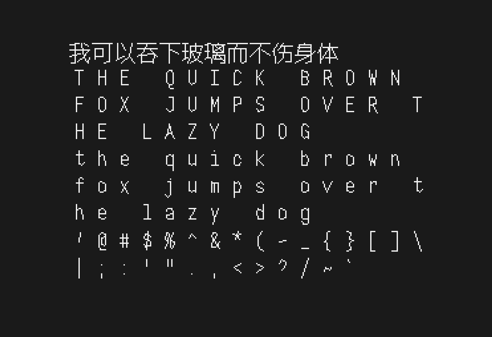
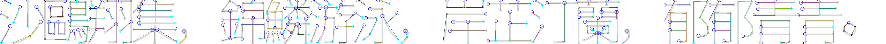

# TinyFont



> 一个专门为嵌入式系统设计的、基于骨架提取的矢量字体生成工具。本项目遵循 [MIT License](LICENSE) 开源协议。

## 项目结构

```text
TinyFont/
├── core_algo.py    # 核心算法实现（骨架提取、笔画分割逻辑）
├── gen.py          # 命令行入口脚本（负责 Build 和 Test 流程）
├── show.py         # 字体查看器（GUI 工具，支持预览生成的字体）
├── tinyfont.py     # 字体数据结构定义与运行时支持
└── analyze.py      # 字体数据分析工具

```

## 核心原理

1. **骨架提取**：首先提取字形中心线并拆解为 `raw_strokes`。
   

2. **矢量简化**：对笔画进行 RDP 简化和去噪，生成最终的 `segments`。
   

## 快速开始

### 安装依赖

首先，请确保安装了项目所需的 Python 依赖：

```bash
pip install -r requirements.txt

```

## 使用说明

### 1. 生成工具

`gen.py` 是本项目的主程序，负责执行字体的骨架提取、测试和生成工作。

#### 1.1 生成字体

将输入的字体文件（如 .ttf/.otf）转换为 TinyFont 格式（.tyf）及 JSON 数据。

```bash
# 基础用法
python gen.py build path/to/input_font.ttf

# 指定输出文件名（默认为 font）并开启全 Unicode 扫描
python gen.py build path/to/input_font.ttf --output my_font --full_scan

```

| 参数 | 类型 | 默认值 | 说明 |
| --- | --- | --- | --- |
| `input` | String | (必填) | 输入的字体文件路径 |
| `--output` | String | `font` | 输出文件的基本名称 (生成 .json/.tyf) |
| `--full_scan` | Flag | `False` | 是否扫描完整的 Unicode 范围 |

#### 1.2 测试效果

在不生成最终文件的情况下，测试提取算法对字体的处理效果。

```bash
# 默认模式：从 teststrings.txt 中随机抽取字符测试
python gen.py test font1.ttf --nsample 20

# 自定义语料模式：指定字符串进行测试（此时 --nsample 被忽略）
python gen.py test font1.ttf --corpus "Hello World"

```

| 参数 | 类型 | 默认值 | 说明 |
| --- | --- | --- | --- |
| `fonts` | String | (必填) | 一个或多个待测试的字体文件路径 |
| `--nsample` | Int | `8` | 随机采样的字符数量（仅在未指定 `--corpus` 时有效，默认从 `teststrings.txt` 中抽取） |
| `--corpus` | String | `""` | 自定义测试字符串或语料库路径。如果指定，将忽略 `--nsample` 并按序渲染该内容 |

#### 1.3 通用调节参数

以下参数适用于 **Build** 和 **Test** 命令，用于微调核心骨架提取算法和简化策略：

| 参数 | 默认值 | 说明 |
| --- | --- | --- |
| `--width` | `127` | 处理时的图像宽度 (px) |
| `--height` | `127` | 处理时的图像高度 (px) |
| `--strw` | `10` | 提取算法使用的标称笔画宽度 (Nominal stroke width) |
| `--simplify_eps` | `6.0` | RDP (Ramer-Douglas-Peucker) 简化算法的阈值 |
| `--spur_len` | `2.0` | 去除毛刺 (Spur pruning) 的长度阈值 |
| `--join_dist` | `6.0` | 合并相邻端点的最大距离 |

---

### 2. 可视化预览

这是一个独立的 GUI 工具，用于加载并查看生成的字体文件（支持 .tyf 二进制文件或中间态 .json 文件）。

```bash
# 启动 GUI 查看器
python show.py

```

## 字体格式规范

生成的 .tyf 二进制文件格式及数据结构定义，请详细参阅[TinyFont Specification](doc/tinyfont_spec.md)。该文档详细描述了如何在嵌入式设备上解析和渲染字体数据。

## 致谢

本项目的基础代码和灵感来源于 [chinese-hershey-font](https://github.com/LingDong-/chinese-hershey-font)。特别感谢 [LingDong-](https://github.com/LingDong-) 提供的原始实现与灵感。
